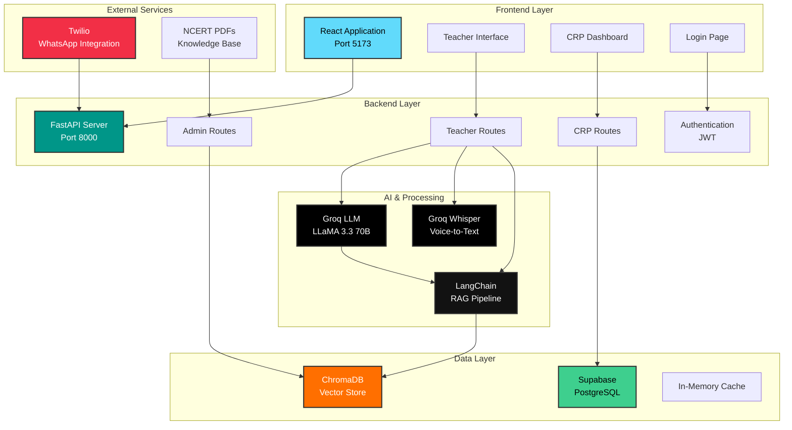

<div align="center">

# 🎓 Shiksha Mitra
### AI-Powered Teacher Support Platform

[](https://www.python.org/)
[](https://fastapi.tiangolo.com/)
[](https://reactjs.org/)
[](https://vitejs.dev/)
[](https://tailwindcss.com/)

[](https://www.langchain.com/)
[](https://www.trychroma.com/)
[](https://groq.com/)
[](https://jwt.io/)
[](https://supabase.com/)
[](https://www.twilio.com/)

*A full-stack web application that provides AI-powered assistance to teachers and comprehensive analytics dashboards for Cluster Resource Persons (CRPs).*

</div>

---

## 📋 Table of Contents

- [Features](#-features)
- [Architecture](#-architecture)
- [Tech Stack](#-tech-stack)
- [Installation & Setup](#-installation--setup)
- [Usage Guide](#-usage-guide)
- [API Endpoints](#-api-endpoints)
- [Project Structure](#-project-structure)
- [Demo Credentials](#-demo-credentials)
- [Production Deployment](#-production-deployment-notes)
- [Troubleshooting](#-troubleshooting)

---

## ✨ Features

### For Teachers
- **Text Query Interface**: Ask questions in Hindi, English, or Hinglish
- **Voice Query Support**: Record and submit voice queries
- **Real-time AI Responses**: Get instant answers powered by Groq LLM
- **Query History**: View past questions and answers
- **Multilingual Support**: Automatic language detection and response


---

## 🏗️ Architecture



### System Flow

1. **Teacher Workflow**:
   - Teacher logs in → JWT token issued
   - Submits query (text/voice) → Backend processes
   - Voice → Groq Whisper transcription
   - Query → LangChain RAG retrieves context from ChromaDB
   - Groq LLM generates response with sentiment & topic analysis
   - Response stored in Supabase → Displayed to teacher

2. **CRP Workflow**:
   - CRP logs in → JWT token issued
   - Dashboard fetches analytics from Supabase
   - Real-time charts show teacher activity, topics, sentiment
   - Click teacher → View individual chat history

3. **WhatsApp Integration**:
   - Teacher sends WhatsApp message → Twilio webhook
   - Backend processes query via AI pipeline
   - Response sent back via Twilio

---

## 🛠️ Tech Stack

### Backend

| Technology | Purpose |
|------------|---------|
|  | Modern Python web framework for API development |
|  | LLM (LLaMA 3.3 70B) & Whisper for speech-to-text |
|  | Document processing & RAG pipeline |
|  | Vector database for semantic search |
|  | PostgreSQL database for user data |
|  | WhatsApp integration |
|  | Token-based authentication |
|  | Core programming language |

### Frontend

| Technology | Purpose |
|------------|---------|
|  | UI library for building interactive interfaces |
|  | Fast build tool and dev server |
|  | Client-side routing |
|  | Data visualization library |
|  | Utility-first CSS framework |
|  | Modern icon library |

---

## 📥 Installation & Setup

### Prerequisites
- Python 3.9 or higher
- Node.js 16 or higher
- npm or yarn

### Backend Setup

1. **Navigate to backend directory**:
   ```bash
   cd backend
   ```

2. **Create and activate virtual environment**:
   ```bash
   # Windows
   python -m venv venv
   venv\Scripts\activate

   # Linux/Mac
   python -m venv venv
   source venv/bin/activate
   ```

3. **Install dependencies**:
   ```bash
   pip install -r requirements.txt
   ```

4. **Verify .env file**:
   The `.env` file should already exist with:
   ```
   GROQ_API_KEY=your_api_key_here
   CHROMA_DB_DIR=./data/chroma_db
   ```

5. **Run the backend server**:
   ```bash
   uvicorn app.main:app --reload --host 0.0.0.0 --port 8000
   ```

   The backend will be available at `http://localhost:8000`

### Frontend Setup

1. **Navigate to frontend directory**:
   ```bash
   cd frontend
   ```

2. **Install dependencies**:
   ```bash
   npm install
   ```

3. **Verify .env file**:
   The `.env` file should already exist with:
   ```
   VITE_API_URL=http://localhost:8000
   ```

4. **Run the development server**:
   ```bash
   npm run dev
   ```

   The frontend will be available at `http://localhost:5173`

---

## 🎭 Demo Credentials

### CRP Login
- **Email**: crp1@shiksha.com
- **Password**: password123

OR

- **Email**: crp2@shiksha.com
- **Password**: password123

### Teacher Login
- **Email**: amit@school.com
- **Password**: teacher123

OR

- **Email**: sneha@school.com
- **Password**: teacher123

---

## 📖 Usage Guide

### For Teachers

1. **Login** using teacher credentials
2. **Ask Questions**:
   - Type your question in the text area (supports Hindi, English, Hinglish)
   - OR click "Start Voice Recording" to record your question
3. **View Response**: AI will provide detailed answers with:
   - Topic classification
   - Sentiment analysis
   - Language detection
   - Suggested actions
4. **Check History**: See your recent questions in the sidebar

### For CRPs

1. **Login** using CRP credentials
2. **Dashboard**: View overall analytics
   - Total teachers
   - Active teachers today
   - Query statistics
   - Topic distribution charts
   - Sentiment analysis
3. **Teachers Page**: 
   - View all teachers under supervision
   - See query counts and activity
   - Click "View Chats" to see individual teacher's history
4. **Teacher Detail**: 
   - Review complete chat history
   - Filter by topic
   - View query-response pairs

---

## 🔌 API Endpoints

### Authentication
- `POST /api/auth/login` - User login

### Teacher Endpoints
- `POST /api/teacher/query` - Submit text query
- `POST /api/teacher/query-voice` - Submit voice query
- `GET /api/teacher/history` - Get chat history
- `GET /api/teacher/profile` - Get teacher profile

### CRP Endpoints
- `GET /api/crp/teachers` - Get all teachers
- `GET /api/crp/chats` - Get all chats
- `GET /api/crp/teacher/{teacher_id}/chats` - Get specific teacher's chats
- `GET /api/crp/analytics` - Get analytics data

### Admin Endpoints
- `POST /api/ingest-pdf` - Upload NCERT PDFs for knowledge base

---

## 📁 Project Structure

```
Shisksha/
├── backend/
│   ├── app/
│   │   ├── main.py           # FastAPI app & routes
│   │   ├── auth.py           # Authentication logic
│   │   ├── database.py       # In-memory database
│   │   ├── models.py         # Data models
│   │   ├── schemas.py        # Pydantic schemas
│   │   ├── ai.py             # AI/LLM logic
│   │   ├── db.py             # Vector DB operations
│   │   └── config.py         # Configuration
│   ├── data/
│   │   └── chroma_db/        # Vector database
│   ├── requirements.txt
│   └── .env
│
├── frontend/
│   ├── src/
│   │   ├── components/       # React components
│   │   ├── pages/            # Page components
│   │   ├── services/         # API service
│   │   ├── App.jsx           # Main app component
│   │   └── main.jsx          # Entry point
│   ├── package.json
│   └── .env
```

---

## 🎯 Features Implementation

### Authentication
- JWT-based token authentication
- Role-based access control (CRP/Teacher)
- Secure password hashing with bcrypt
- Token stored in localStorage

### AI Features
- Multi-language support (Hindi, English, Hinglish)
- Voice-to-text transcription using Groq Whisper
- Context-aware responses using RAG
- Sentiment and topic classification

### Analytics
- Real-time query tracking
- Topic distribution analysis
- Sentiment monitoring
- Teacher activity tracking
- Language usage statistics

---

## 🔧 Development

### Adding New NCERT PDFs
```bash
curl -X POST http://localhost:8000/api/ingest-pdf \
  -F "file=@path/to/your.pdf"
```

### Running Tests
```bash
# Backend
cd backend
pytest

# Frontend
cd frontend
npm test
```

---

## 🚀 Production Deployment Notes

1. **Security**:
   - Change `SECRET_KEY` in `backend/app/auth.py`
   - Use environment variables for all sensitive data
   - Enable HTTPS
   - Set proper CORS origins

2. **Database**:
   - Replace in-memory database with PostgreSQL/MongoDB
   - Set up proper database migrations
   - Implement data persistence

3. **Scaling**:
   - Use Redis for session management
   - Implement caching layer
   - Use CDN for frontend assets
   - Set up load balancers

---

## 🔍 Troubleshooting

### Backend Issues
- **Port 8000 already in use**: Change port in uvicorn command
- **Module not found**: Ensure virtual environment is activated
- **GROQ API errors**: Verify API key in .env

### Frontend Issues
- **API connection failed**: Ensure backend is running on port 8000
- **Build errors**: Delete node_modules and reinstall
- **Microphone not working**: Check browser permissions

---

## 📄 License

This project is for educational purposes.

---

## 🤝 Support

For issues or questions, please create an issue in the repository.

---

<div align="center">

### Made with ❤️ for Teachers and Education

**[⬆ Back to Top](#-shiksha-mitra)**

</div>
